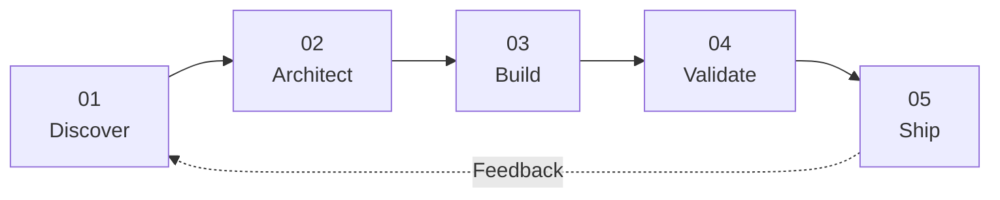

<p align="center">
  
</p>

<p align="center">
  <a href="https://github.com/oguzhann123?tab=repositories">
    
  </a>
  
</p>

<p align="center">
  
</p>

<p align="center">
  
  
  
  
  
</p>

---

## `$ whoami`

```ts
const oguzhan = {
  mindset: "Think deeply. Build clearly. Improve continuously.",

  engineeringStyle: [
    "turning complex ideas into understandable systems",
    "choosing maintainability over unnecessary complexity",
    "building beyond the prototype stage",
    "treating security and usability as core requirements",
  ],

  values: {
    code: "clean and intentional",
    architecture: "practical and scalable",
    products: "useful and reliable",
    learning: "continuous",
  },

  currentMode: "building, testing, refining",
};
```

<p>
  I approach software as a complete product rather than a collection of
  disconnected features. I care about clear architecture, reliable execution
  and systems that can continue evolving without becoming fragile.
</p>

---

## `> engineering.workspace`

```text
╭─ ENGINEERING WORKSPACE ─────────────────────────────────────────────────────╮
│                                                                            │
│  MODE        product engineering                                           │
│  FOCUS       useful systems, clear architecture, reliable execution        │
│  STANDARD    production-ready — not merely demo-ready                      │
│  PROCESS     understand → design → build → validate → improve              │
│                                                                            │
╰────────────────────────────────────────────────────────────────────────────╯
```

<table>
  <tr>
    <td width="33%" align="center" valign="top">
      <br />
      <code>01 / PRODUCT</code>
      <h3>◈ Product Engineering</h3>
      <p>
        Turning uncertain ideas into complete products with clear user flows,
        practical requirements and meaningful outcomes.
      </p>
      <p>
        <sub>Concept → Experience → Product</sub>
      </p>
      <br />
    </td>
    <td width="33%" align="center" valign="top">
      <br />
      <code>02 / SYSTEM</code>
      <h3>⬡ Architecture</h3>
      <p>
        Designing understandable boundaries, dependable data flows and systems
        that remain maintainable as they grow.
      </p>
      <p>
        <sub>Boundaries → Contracts → Infrastructure</sub>
      </p>
      <br />
    </td>
    <td width="33%" align="center" valign="top">
      <br />
      <code>03 / DELIVERY</code>
      <h3>⌁ Execution</h3>
      <p>
        Building, validating and refining software beyond the happy path and
        beyond the prototype stage.
      </p>
      <p>
        <sub>Implementation → Testing → Production</sub>
      </p>
      <br />
    </td>
  </tr>
</table>

<br />

<p align="center">
  <strong><code>idea_to_product.pipeline</code></strong>
</p>



<p align="center">
  <sub>
    Understand the problem before choosing the technology.
  </sub>
</p>

---

## `> project.types`

<table>
  <tr>
    <td width="50%" valign="top">
      <h3>▣ Full-Stack Products</h3>
      <p>
        Complete user-facing platforms combining interfaces, APIs,
        authentication, persistent data and operational workflows.
      </p>
      <p>
        <code>interface</code>
        <code>backend</code>
        <code>database</code>
        <code>deployment</code>
      </p>
    </td>
    <td width="50%" valign="top">
      <h3>◇ Blockchain Systems</h3>
      <p>
        Applications connecting smart contracts, transactions, ownership,
        verification and practical user experiences.
      </p>
      <p>
        <code>contracts</code>
        <code>dApps</code>
        <code>verification</code>
        <code>infrastructure</code>
      </p>
    </td>
  </tr>
  <tr>
    <td width="50%" valign="top">
      <h3>◫ Browser-Native Software</h3>
      <p>
        Extensions built around background processes, page context,
        local state, secure messaging and focused user interaction.
      </p>
      <p>
        <code>extensions</code>
        <code>local-first</code>
        <code>messaging</code>
        <code>security</code>
      </p>
    </td>
    <td width="50%" valign="top">
      <h3>◉ Interactive Experiences</h3>
      <p>
        Games and participation-driven systems involving progression,
        identity, digital assets and persistent state.
      </p>
      <p>
        <code>games</code>
        <code>identity</code>
        <code>progression</code>
        <code>ownership</code>
      </p>
    </td>
  </tr>
</table>

<br />

```ts
const deliveryStandard = {
  architecture: "clear enough to explain",
  implementation: "simple enough to maintain",
  security: "considered before release",
  quality: "tested beyond the happy path",
  outcome: "software designed to keep evolving",
};
```

<p align="center">
  <strong>Complex ideas. Clear systems. Reliable products.</strong>
</p>

---

## `> open.connection`

<p align="center">
  <a href="https://github.com/oguzhann123?tab=repositories">
    
  </a>
  <a href="https://www.linkedin.com/in/YOUR_LINKEDIN_USERNAME">
    
  </a>
  <a href="mailto:YOUR_EMAIL">
    
  </a>
</p>

<p align="center">
  <sub>
    Open to ambitious products, difficult engineering problems and meaningful collaborations.
  </sub>
</p>

<br />

<p align="center">
  
</p>
